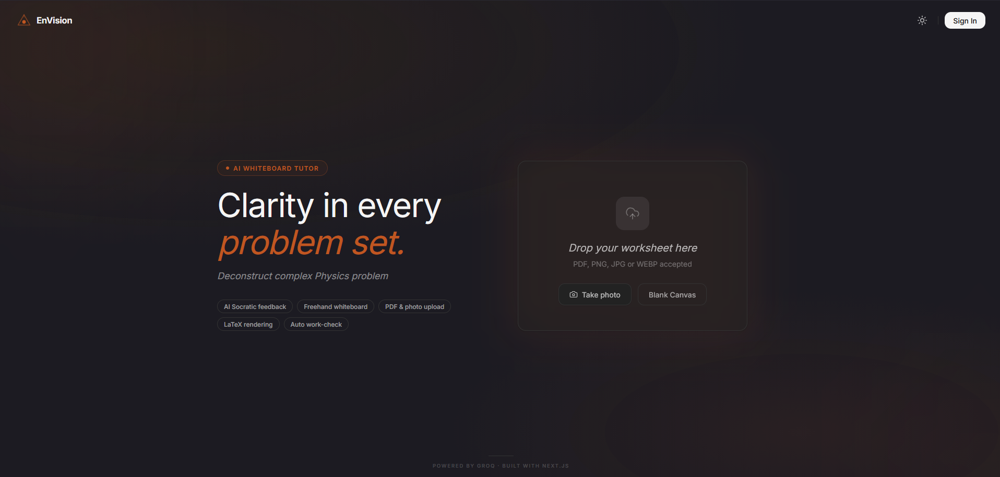

# EnVision



An AI-tutored whiteboard for physics, chemistry, and calculus. Upload a problem set, work it out by hand on the canvas, and get Socratic feedback as you go—instead of just being handed the answer.

You can jump straight in and use it anonymously, or sign in with a magic link to save your work.

## Features

- **Instant Workspaces**: Start learning immediately. No account required to jump into a blank canvas or upload a document.
- **Socratic AI Tutor**: Get hints and guidance on your work via chat. The AI checks your math and asks guiding questions.
- **File Uploads**: Works with PDFs and images. You can also use the integrated camera to snap a picture of your homework.
- **Privacy-first**: "Sign in to save work" approach. Anonymous sessions are protected by a one-time Captcha to keep bots out.
- **Magic Link Auth**: Easy, passwordless sign-in when you're ready to save your progress.

## Tech Stack

- **Framework**: Next.js (App Router) + Tailwind CSS
- **Database & Auth**: Supabase (Postgres, Magic Links, Anonymous sessions)
- **Canvas**: Fabric.js for drawing, PDF.js for worksheet imports
- **AI Models**: Groq / NVIDIA NIM for fast vision transcription and reasoning
- **Security**: Cloudflare Turnstile for Captcha verification

## Getting Started

1. Clone the repo and copy `.env.example` to `.env.local`.
2. Fill in your Supabase and AI provider keys.
   - `NEXT_PUBLIC_TURNSTILE_SITE_KEY` and `TURNSTILE_SECRET_KEY` are required for the one-time Captcha.
   - **Note:** Make sure to enable "Enable Captcha protection" in your Supabase Auth configuration (using Cloudflare Turnstile) to secure the endpoints.

3. Install dependencies and start the dev server:

```bash
pnpm install
pnpm dev
```

4. Open [http://localhost:3000](http://localhost:3000) in your browser.

## Database

The database schema and RLS policies are located in `supabase/migrations/`. Push them to your Supabase project with:

```bash
pnpm db:push
```

## Available Scripts

- `pnpm dev` — Start the development server
- `pnpm build` / `pnpm start` — Production build and serve
- `pnpm check` — Typecheck, lint, and format-check
- `pnpm fix` — Lint and auto-fix formatting
- `pnpm db:push` — Push local Supabase migrations to your linked project
