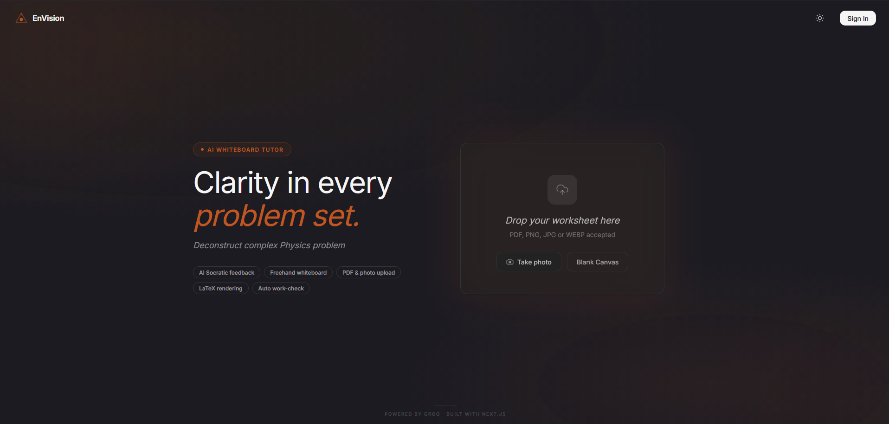

# EnVision



An AI-tutored whiteboard for STEM subjects. It is meant to stay useful from a first look at a topic through university physics, organic chemistry, and differential equations, and it also covers circuits, algorithms, and code. Upload a problem set or start with a blank canvas, work it out by hand, and get Socratic feedback as you go instead of just being handed the answer.

Jump straight in anonymously, or sign up to save your work and pick up where you left off.

## Features

- **Instant Workspaces**: Start learning immediately — no account required. Drop in a PDF, image, snap a photo with the built-in camera, or paste a screenshot directly onto the canvas with `Ctrl+V` / `⌘V`.
- **Socratic AI Tutor**: Check my work, or look closer. The tutor reads the board, then asks a guiding question instead of handing over the answer. Chat stays open for follow-ups.
- **Live voice**: Talk keeps a voice session open. Gemini reads one picture of the board after the pen rests. `GEMINI_API_KEY` stays on the server; the browser only gets a short-lived token.
- **Checks on the page**: Simple equalities and unit mismatches (for example km/h added to m/s) are checked locally before the reply treats them as correct.
- **Graph**: Plot an equation from the board, pan and zoom, and drag sliders for extra letters. `dy/dx` and `y'` draw a slope field.
- **Printed problem**: A pasted page is read first by vision. If that fails, a plain-text guess is shown in an editable chip so you can correct notation. Later handwriting is read separately.
- **Help style**: One step at a time, short explanations, larger type, and calmer motion. After a reply, Explain another way and Smaller hint send that question.
- **Direct Clipboard Paste & Drag-and-Drop**: Copy any problem screenshot from your browser or textbook and press `Ctrl+V` (or `⌘V`) to paste it right onto the whiteboard, or drag and drop image/PDF files directly onto the canvas.
- **LaTeX Rendering**: All AI responses render math using KaTeX — inline and block expressions, fractions, integrals, chemistry notation, and more.
- **Freehand Whiteboard**: Pen, eraser, shapes (rectangle, circle, line), text, color, undo/redo, grid, and download. Scroll zooms. Hold the wheel, or hold Shift while scrolling, to move the page. Built on Fabric.js.
- **File Uploads**: PDF and image support (PNG, JPG, WEBP). Pages are rendered onto the canvas via PDF.js.
- **Privacy-first**: Anonymous sessions are created on first use, protected by a one-time Captcha. Sign up later to migrate all your workspaces to a permanent account.
- **Email Auth**: Sign in or create an account with email and password. Anonymous workspaces are automatically migrated on sign-up.

## Tech Stack

- **Framework**: Next.js (App Router) + Tailwind CSS v4
- **Database & Auth**: Supabase (Postgres, anonymous sessions, email/password auth)
- **Canvas**: Fabric.js for drawing, PDF.js for worksheet imports
- **AI — Vision**: NVIDIA NIM (`nemotron-3-nano-omni`) for the board. Gemma 4 31B is the backup when NVIDIA is busy.
- **AI — Reasoning**: Groq for the quick check and chat; NVIDIA NIM (`nemotron-3-super-120b`) for a closer look
- **AI — Voice**: Gemini Live (`@google/genai`), then the 2.5 native-audio model, then 3.1 Flash Live
- **Graph and checks**: mathjs for plots; local algebra and unit checks
- **AI SDK**: Vercel AI SDK (`ai` + `@ai-sdk/groq`) for streaming chat
- **Math Rendering**: KaTeX via `rehype-katex` + `remark-math`
- **Security**: Cloudflare Turnstile for Captcha verification

## Getting Started

1. Clone the repo and copy `.env.example` to `.env.local`, then fill in all keys.

> **Note:** Make sure to enable **"Enable Captcha protection"** in your Supabase Auth configuration (using Cloudflare Turnstile) to secure the auth endpoints.

2. Install dependencies and start the dev server:

```bash
pnpm install
pnpm dev
```

3. Open [http://localhost:3000](http://localhost:3000) in your browser.

## Database

The database schema and RLS policies are in `supabase/migrations/`. Push them to your Supabase project with:

```bash
pnpm db:push
```

## Deployment

The project is designed to deploy on Vercel.

### Keep-alive (Supabase free tier)

Free Supabase projects can pause after about a week with too few database queries. This app can sit unused for longer than that, so a schedule keeps it active. Hobby cron can run once a day, at **14:15 UTC**, and hits `GET /api/cron/keep-alive`. A GitHub Action calls the same route at 02:15, 10:15, and 18:15 UTC. Each run calls `run_keep_alive()`, which:

1. Increments `keep_alive_counter` (write)
2. Inserts a row into `keep_alive_pings` (write)
3. Prunes old ping rows (delete)
4. Counts rows in `profiles`, `workspaces`, and `messages` (reads)
5. Optionally pings Upstash Redis if configured

**Vercel:** set `CRON_SECRET` and `SUPABASE_SERVICE_ROLE_KEY` in Production. Vercel sends `Authorization: Bearer <CRON_SECRET>` on cron invocations. For the extra daily reads, add repository secrets `APP_URL` (production origin, no trailing slash) and `CRON_SECRET` (same value) so `.github/workflows/keep-alive.yml` can call the route. Success looks like `{ "ok": true, "supabase": { "ok": true, "result": { "pingCount": N, ... } } }`.

Set `GEMINI_API_KEY` for the live Talk button. The key stays on the server. The browser receives a short-lived token.

If the project is already paused, restore it in the Supabase dashboard first; keep-alive cannot unpause a project.

After pulling schema changes, push migrations:

```bash
pnpm db:push
```

## Available Scripts

- `pnpm dev` — Start the development server
- `pnpm build` / `pnpm start` — Production build and serve
- `pnpm check` — Typecheck, lint, and format-check
- `pnpm fix` — Lint and auto-fix formatting
- `pnpm test` — Algebra and unit checks
- `pnpm db:push` — Push local Supabase migrations to your linked project
